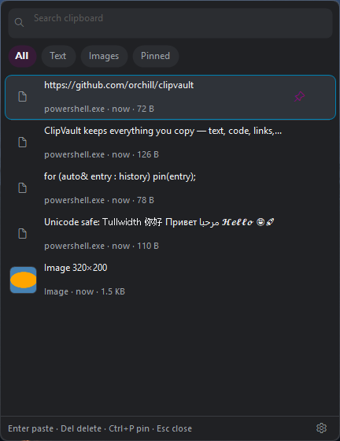
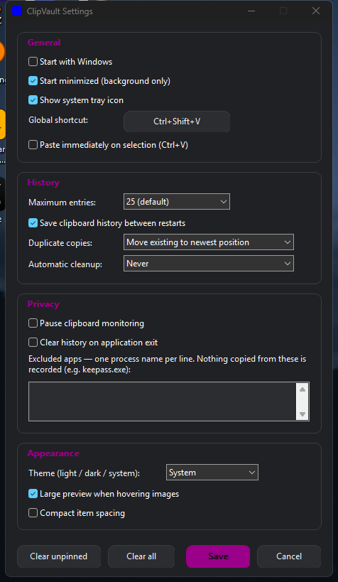

# 📋 ClipVault

A lightweight, **native Windows clipboard manager** focused on speed, privacy, and minimal system resource usage. ClipVault sits silently in your system tray, remembers everything you copy, and brings it back with a single keystroke.



## ✨ Technologies

- C++20 — pure Win32, no frameworks
- Event-driven clipboard notifications (`AddClipboardFormatListener`, zero polling)
- GDI+ custom-rendered UI
- CMake + MSVC or MinGW-w64

## 🚀 Features

- Global hotkey (default `Ctrl+Shift+V`, fully configurable) opens a fast history popup
- Text, rich text (RTF), HTML, emojis, fancy Unicode (𝓗𝓮𝓵𝓵𝓸, Ｆｕｌｌｗｉｄｔｈ), images and copied files
- Original clipboard formats are preserved — restoring an item puts the real RTF / image / file data back on the clipboard, not just plain text
- **Pin** the entries you use often — pinned items never age out
- **Search** as you type, plus quick filters (All / Text / Images / Pinned)
- History persists across restarts (optional)
- Duplicate detection — copying the same thing again just moves it to the top
- Large preview when hovering image entries (1.5 s dwell, on by default, toggleable in Settings)
- Light / dark / system theme, per-monitor DPI aware
- System tray integration: open, pause monitoring, clear history, start with Windows

## ⚡ Performance

ClipVault is built to sit in the tray all day without you noticing:

- **0% CPU while idle** — event-driven, no polling, no background scanning
- **~14 MB RAM** working set (3 MB private)
- **1 MB executable** — statically linked, no runtime dependencies, no installer
- Disk writes are debounced and deduplicated — identical copies share one file, huge screenshots are compressed automatically

## 🔒 Privacy

Everything stays on your machine. ClipVault contains **no networking code at all** — no telemetry, no accounts, no cloud. You can pause monitoring at any time, delete individual entries, clear history (unpinned or all), disable persistence, and exclude specific apps (like your password manager) from ever being recorded.

## 🛠️ Building

**Prerequisites:** Windows 10 (1607+) or 11, plus one of:

- Visual Studio Build Tools with the C++ workload, or
- MinGW-w64 (GCC) with `g++` and `windres` on PATH

1. Clone the repository
2. Run `build.bat` — it auto-detects MSVC or MinGW, generates the icon, and produces `ClipVault.exe`

   ```bat
   build.bat
   ```

   or with CMake:

   ```bat
   cmake -S . -B build
   cmake --build build --config Release
   ```

3. Run `ClipVault.exe` — it lives in the tray. Press `Ctrl+Shift+V` to open your history.

## ⌨️ Shortcuts

| Key | Action |
|-----|--------|
| `Ctrl+Shift+V` | Open / close history (configurable) |
| `↑` / `↓` | Select an entry |
| `Enter` | Paste it back (writes to clipboard + sends Ctrl+V) |
| `Ctrl+P` | Pin / unpin |
| `Del` | Delete entry |
| `Esc` | Close |

## 🖼️ Settings



## 📄 License

MIT — see [LICENSE](LICENSE).
